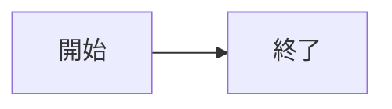

# Phase Obsidian-Plugin Stage 3a 実装メモ

> 2026-05-14 / ブランチ: `feat/obsidian-plugin-stage3a`

## 何を作ったか

`mermaid-maker` code block の先頭行付近に **`%%editable%%` コメント**を書くと、
Stage 2b の HTML labels 描画ではなく **xyflow キャンバスを read-only でマウント**する分岐を実装した。



設計ドキュメント: `../../50_Mission/MermaidMaker/Atom-XyflowMounter.md` / `Atom-DagreLayout.md` / `Arrow-MmEditableFlow.md`

## ファイル構成

```
packages/obsidian/
├ package.json               + react, react-dom, @xyflow/react, dagre, @types/*
├ tsconfig.json              + jsx: 'react-jsx'
├ esbuild.config.mjs         + jsx: 'automatic', .tsx loader, CSS rename plugin
└ src/
   ├ main.ts                 isEditable() で 2b/3a 分岐
   ├ atoms/
   │  ├ dagre-layout.ts      [Stage 3a 追加] Atom-DagreLayout
   │  └ xyflow-mounter.tsx   [Stage 3a 追加] Atom-XyflowMounter
   └ arrows/
      └ mm-editable-flow.ts  [Stage 3a 追加] Arrow-MmEditableFlow
```

## アーキテクチャ概要

```
mermaid-maker code block
  │
  ▼
main.ts: registerMarkdownCodeBlockProcessor
  │
  └─ isEditable(source) で分岐
     ├ false → Arrow-MmCodeBlockRender (Stage 2b, HTML labels 描画)
     └ true  → Arrow-MmEditableFlow (Stage 3a)
              │
              ├ parseMermaid(source)         core Atom-MermaidParser
              ├ extractPositionComments     core Atom-PositionStore
              ├ fillMissingPositions        Atom-DagreLayout
              ├ rfNodes / rfEdges 整形      （Edge 型は source/target に注意）
              └ mountXyflow                 Atom-XyflowMounter
                 │
                 └ React.createRoot + <ReactFlow ... />
                 cleanup: MarkdownRenderChild.onunload で root.unmount
```

## 重要な実装判断

### 1. `%%editable%%` フラグでの分岐
設計では Atom-EditModeToggle (overlay 編集ボタン) で起動する方式を考えていたが、
3a スパイクではより素朴な「mermaid コメントによる opt-in」を採用。

```ts
function isEditable(source: string): boolean {
  const firstFew = source.split('\n').slice(0, 3).join('\n');
  return /%%\s*editable\s*%%/.test(firstFew);
}
```

mermaid コメント `%% ... %%` は mermaid 公式パーサに無視される & 自前パーサも
コメントを `extractPositionComments` 同様に剥がせる。ユーザ可読性も保たれる。
Stage 3e で UI 起動に置き換える方向。

### 2. xyflow v12 controlled state での edge 描画問題

**3a 最大のハマり**。`<ReactFlow nodes={...} edges={...} />` で edges が
完全に描画されない（`.react-flow__edge` 要素自体が DOM に出ない）。

原因: xyflow v12 は controlled state を使う場合、各 node の `measured` プロパティが
存在しないと edge 端点を計算しないため、edge を生成しない。

解決: rfNodes 構築時に明示的に渡す。

```ts
const rfNodes = graph.nodes.map((n) => ({
  id: n.id,
  position: positions[n.id] ?? { x: 0, y: 0 },
  data: { label: ... },
  measured: { width: 140, height: 56 },  // ← 必須
}));
```

`width`/`height` を node 直下に渡しても駄目（v12 は別物として扱う）。
`defaultNodes`/`defaultEdges` 経由なら不要だが、その場合は React state 制御が
できないため将来 Stage 3b で困る。

### 3. CodeMirror embed が parent を 0 サイズに潰す

`registerMarkdownCodeBlockProcessor` の `el` は `.cm-preview-code-block` 内の
widget。親チェーン (`.cm-content` → `.cm-contentContainer` → ...) で flex 制約
により高さが 0 になる場合がある。

解決: `el` に直接スタイルを当てず、**内側に wrapper div を新設**して固定 px height で
矩形を確保。

```ts
parent.empty();
const wrapper = parent.createDiv();
wrapper.style.cssText = [
  'display: block',
  'box-sizing: border-box',
  'height: 420px',  // 固定 px。% 単位は親が 0 だと 0 になる
  'width: 100%',
  'min-width: 320px',
  ...
].join(';');
createRoot(wrapper).render(<ReactFlow ... />);
```

### 4. CSS の取り扱い: main.css → styles.css

`import '@xyflow/react/dist/style.css'` を main.ts 経由で含めると、esbuild は
`main.css` というエントリ別ファイルを出力する。Obsidian の plugin loader は
プラグインフォルダの **`styles.css` を自動ロードする規約**なので、build 後に
リネームが必要。

esbuild plugin の onEnd フックで対応:

```js
{
  name: 'rename-css',
  setup(build) {
    build.onEnd(() => {
      const src = `${PLUGIN_OUT_DIR}/main.css`;
      const dst = `${PLUGIN_OUT_DIR}/styles.css`;
      if (existsSync(src)) {
        try { renameSync(src, dst); } catch {}
      }
    });
  },
}
```

### 5. Edge 型は `source`/`target`

`@akitaroh/mermaid-core` の `Edge` 型は `{ id, source, target, label?, shape? }`。
xyflow も同じ field 名なので素直に map できる。

```ts
const rfEdges = graph.edges.map((e) => ({
  id: e.id,
  source: e.source,   // ✅
  target: e.target,   // ✅
  label: e.label,
}));
```

`e.from` / `e.to` は存在しない。最初これで書いて dagre.setEdge にも `undefined`
を渡してしまい、edge 無しで dagre が node を縦に積む結果になった。

### 6. dagre の rankdir

`graph.direction` (`'LR'` | `'TD'`) を dagre の `rankdir` に渡す。
- `'LR'` → 左から右
- `'TD'` → 上から下（dagre 公式は `'TB'` だが `'TD'` も互換動作）

```ts
g.setGraph({ rankdir: direction, nodesep: 60, ranksep: 80 });
```

## ライフサイクル

```
code block 検出
  ↓
Arrow-MmEditableFlow 起動
  ↓
mountXyflow → React root 生成
  ↓
MarkdownRenderChild.onunload に root.unmount を仕込む
  ↓
ctx.addChild(child)
  ↓
（タブ閉じ / file 切替で Obsidian が child.unload を呼ぶ）
  ↓
root.unmount で React tree 破棄、xyflow 内 listener も全 cleanup
```

## バンドルサイズ

production build 後の `main.js` = **414 KB**（React + xyflow + dagre + 既存 Stage 2b atoms 全部同梱）。  
比較: Stage 2b 単独は 2.7 KB だったので、xyflow セットで 400 KB 増。Obsidian plugin としては十分許容範囲。

## 確認済み動作

- `%%editable%%` 付き → xyflow キャンバス（4 ノード + 4 エッジ + LR レイアウト + zoom controls + 標準 xyflow スタイル）
- `%%editable%%` 無し → Stage 2b の HTML labels 描画（wikilink + tag + math 描画）
- 両者は同じ `mermaid-maker` block 名で共存
- Live Preview / Reading view 両方で動く
- プラグイン unload 時に React root が確実に unmount される

## 次のステップ (Stage 3b)

- ノードドラッグを有効化 (`nodesDraggable={true}`)
- `onNodesChange` を実装してメモリ上の graph state を更新
- Atom-MarkdownWriteBack を実装し、debounce 500ms で editor.replaceRange
- write-back の整合性: 既存座標コメント (`%% pos %%`) との往復が壊れないこと
- onNodesChange → Atom-MermaidEmitter → Atom-MarkdownWriteBack の経路を Arrow に追加

## 関連設計ドキュメント

- `../../50_Mission/MermaidMaker/Atom-XyflowMounter.md`
- `../../50_Mission/MermaidMaker/Atom-DagreLayout.md`
- `../../50_Mission/MermaidMaker/Arrow-MmEditableFlow.md`
- `../../50_Mission/MermaidMaker/00_MermaidMaker.md` (HOME)

## 関連 Fleeting

- `../../30_Fleeting/Excalidraw_Obsidian統合の学び.md`
- `../../30_Fleeting/EnhancingMindmap_Obsidian双方向同期の学び.md`
- `../../30_Fleeting/MermaidVisualEditor_xyflow式の学び.md`
- `../../30_Fleeting/ホストアプリの機能を最大限再利用する.md`
